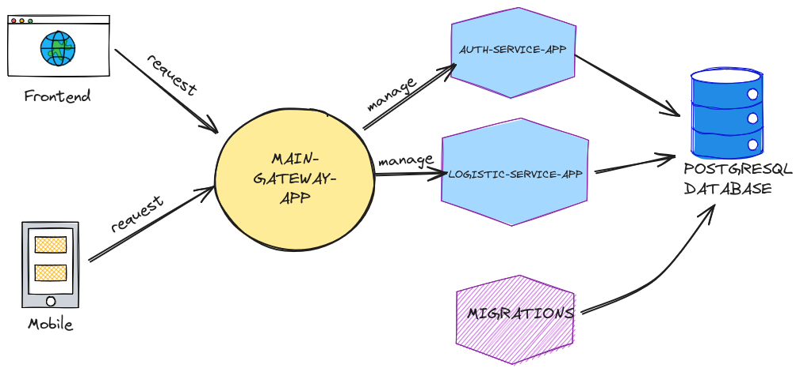

# ORDERFAZ BACKEND TEST

## Used Stack

- NodeJS 20
- PostgreSQL 14
- Docker
- NestJS Framework

## Services

- MAIN-GATEWAY-APP : berfungsi sebagai perantara, mengatur services-service diantaranya (AUTH-SERVICE-APP,LOGISTIC-SERVICE-APP, dan MIGRATIONS)
- AUTH-SERVICE-APP : berfungsi sebagai service authentication,user,dll
- LOGISTIC-SERVICE-APP : berfungsi sebagai service logistic
- MIGRATIONS : berfungsi sebagai migrations database

## Configuration

---

- ### DATABASE-MIGRATION

1. buat database pada postgresql example name: (db_order_faz)
2. masuk ke folder/ service migrations-database dan Buat atau modifikasi .env.example menjadi .env di folder migrations-database dengan contoh sebagai berikut

```bash
DB_HOST=localhost
DB_PORT=5432
DB_USER=postgres
DB_PASSWORD=asdf1234
DB_NAME=db_order_faz
```

3. setelah itu jalankan beberapa command berikut:

```bash
 npm run migration:run
```

---

- ### AUTH-SERVICE-APP
  1. Buat atau modifikasi .env.example menjadi .env di folder auth-service-app dengan contoh sebagai berikut

```bash
DB_HOST=localhost ## alamat host postgresql
DB_PORT=5432 ## alamat port postgresql
DB_USER=postgres ## user postgresql
DB_PASSWORD=asdf1234 ## password postgresql
DB_NAME=db_order_faz ## database postgresql

APP_HOST_SERVICE=0.0.0.0 ##Alamat host AUTH SERVICE
APP_PORT_SERVICE=4001 ##Alamat port AUTH SERVICE

JWT_SECRET_KEY='898FA57BF9974147EAEDFFE974CAE' # jwt secret key
JWT_EXPIRED='24h' # jwt duration expired
```

2. Bila menggunakan docker jalankan beberapa command dibawah ini

Build Docker image

```bash
docker build -t auth-service-app .
```

lalu bila sudah dibuild lakukan run dockernya

```bash
docker run -d -p 4001:4001 --env-file .env auth-service-app
```

3. Bila menggunakan nodejs / tanpa docker jalakan menggunakan command dibawah ini

```
npm run build
```

```
npm run start

```

---

- ### LOGISTIC-SERVICE-APP
  1. Buat atau modifikasi .env.example menjadi .env di folder logistic-service-app dengan contoh sebagai berikut

```bash
DB_HOST=localhost ## alamat host postgresql
DB_PORT=5432 ## alamat port postgresql
DB_USER=postgres ## user postgresql
DB_PASSWORD=asdf1234 ## password postgresql
DB_NAME=db_order_faz ## database postgresql

APP_HOST_SERVICE=0.0.0.0 ##Alamat host AUTH SERVICE
APP_PORT_SERVICE=4002 ##Alamat port AUTH SERVICE

JWT_SECRET_KEY='898FA57BF9974147EAEDFFE974CAE' # jwt secret key
JWT_EXPIRED='24h' # jwt duration expired
```

2. Bila menggunakan docker jalankan beberapa command dibawah ini

Build Docker image

```bash
docker build -t logistic-service-app .
```

lalu bila sudah dibuild lakukan run dockernya

```bash
docker run -d -p 4001:4001 --env-file .env logistic-service-app
```

3. Bila menggunakan nodejs / tanpa docker jalakan menggunakan command dibawah ini

```
npm run build
```

```
npm run start

```

---

- ### MAIN-GATEWAY-APP

1. Buat atau modifikasi .env.example menjadi .env di folder main-gateway-app dengan contoh sebagai berikut

```bash
JWT_SECRET_KEY='898FA57BF9974147EAEDFFE974CAE'
JWT_EXPIRED='24h'
APP_MAIN_PORT=4000

APP_HOST_AUTH_SERVICE=0.0.0.0 ##Alamat host AUTH SERVICE
APP_PORT_AUTH_SERVICE=4001  ##Alamat port AUTH SERVICE

APP_HOST_LOGISTIC_SERVICE=0.0.0.0 ##Alamat host Logistic SERVICE
APP_PORT_LOGISTIC_SERVICE=4002 ##Alamat port Logistic SERVICE
```

2. Bila menggunakan docker jalankan beberapa command dibawah ini

Build Docker image

```bash
docker build -t main-gateway-app .
```

lalu bila sudah dibuild lakukan run dockernya

```bash
docker run -d -p 4000:4000 --env-file .env main-gateway-app
```

3. Bila menggunakan nodejs / tanpa docker jalakan menggunakan command dibawah ini

```
npm run build
```

```
npm run start

```

---

- ### Swagger Documentation
  kunjungi pada link ini: http://localhost:4000/swagger/ atau http://{main-gate-app}/swagger/

atau import tautan swagger json ini

<a href="swagger-json.json">swagger-json.json</a>

---

- Architecture Diagram



---

more information contact me

email: ucuncs.dev@gmail.com / ilham@ucun.dev

github: ucuncs89
